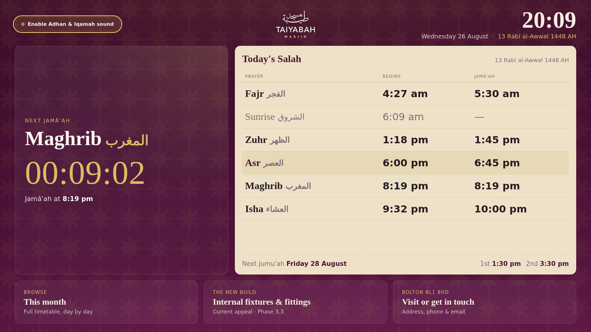

# Taiyabah Masjid — Home Smart Screen

**A live prayer-times display for tablets and TVs — it sounds the Adhan and Iqamah automatically, and
keeps working on a screen nobody is touching.**

🔗 **[View it live](https://yameenbux.github.io/Taiyabah-Masjid-HomeSmartScreen/)**



Built for Bolton Central Islamic Society. It runs on a tablet propped on a shelf at home, or on the
mosque's own wall screens, and it needs no attention once it's set up.

---

## What it does

- **Live clock and countdown** to the next congregational prayer (Jamā'ah)
- **Today's full timetable** — start and Jamā'ah times, with the current prayer highlighted
- **Gregorian and Hijri dates**, and a standing banner for the next Friday prayer (Jumu'ah)
- **Plays the Adhan automatically** 15 minutes before each Jamā'ah, and a short Iqamah at the time itself
- **Full-screen greetings** for Ramadan and both Eids
- **Works offline** and installs to a home screen like a normal app
- **Drivable by a TV remote** — every control reachable with a D-pad, no touchscreen needed

### The hard part

Making a web page sound the Adhan reliably on a device that's been left alone for hours is harder than it
sounds. Browsers refuse to play audio without a user interaction; operating systems freeze background
tabs to save battery; and a screen that has dimmed has usually stopped running JavaScript altogether.

Most of the engineering here is about that problem, and about failing *loudly* when it can't be solved —
a display that quietly stops working is worse than one that says so.

---

## Tech stack

| Layer | What's used | Why |
| --- | --- | --- |
| **Frontend** | HTML5, CSS3, vanilla JavaScript (ES2020) | No framework and no bundler — one self-contained file that a browser can run directly. Fewer moving parts to break on a device nobody maintains |
| **CSS** | Custom properties, Grid, Flexbox, `clamp()` fluid type | One layout scales from a phone to a 1080p TV without breakpoint sprawl |
| **PWA** | Web App Manifest, Service Worker | Installs to a home screen, survives a Wi-Fi drop, launches fullscreen with no address bar |
| **Web APIs** | Media Session, Screen Wake Lock, Page Visibility, `HTMLMediaElement`, `localStorage`, `Intl.DateTimeFormat` | The audio reliability and timezone-correctness work |
| **Build** | Python 3 (standard library only) | Injects prayer data into the page at build time, with assertions that catch a bad substitution before it ships |
| **Image tooling** | Pillow | Generates the Android TV launcher banners from the real logo, reproducibly |
| **Testing** | Playwright (Node.js) | End-to-end browser tests, including simulated clocks and simulated device timezones |
| **CI/CD** | GitHub Actions | Builds and signs the Android TV app in the cloud — no local Android toolchain needed |
| **Mobile packaging** | Bubblewrap (Trusted Web Activity), Android SDK, `apksigner` | Wraps the web app as an installable APK for TV devices |
| **Hosting** | GitHub Pages | Static hosting; a push to `main` is the deploy |

## Engineering highlights

Each of these solved a real failure, and the reasoning is written up in
[`docs/engineering-notes.md`](docs/engineering-notes.md).

**Audio that survives a sleeping device.** Browsers block autoplay, and mobile operating systems suspend
background tabs — so a prayer alert can silently never fire. The fix layers a screen wake lock, a
near-silent looping audio track that keeps the OS treating the page as active media, and a 3-minute
catch-up window that still plays a missed alert on resume. Background Sync, the obvious answer, cannot
work here: a service worker has no audio element at all.

**Failing loudly instead of silently.** A green "sound is on" indicator that lies is worse than no
indicator. The status pill degrades to an amber warning whenever audio output is actually blocked, and
the page logs its own health — timer suspensions, clock corrections — so a misbehaving screen can be
diagnosed rather than guessed at.

**Timezone correctness across a fleet.** Every time was read from the *device's* clock, so a TV stick set
to the wrong timezone would show a complete set of plausible, wrong prayer times. Now rendered in
`Europe/London` regardless of device settings — with a test that drives five different device timezones
and proves they all agree. Against the pre-fix build, three of the five disagreed.

**Television and remote-control UX.** Every control is reachable by D-pad with a visible focus ring
(including a fallback for older TV browsers that don't support `:focus-visible`), modals trap and restore
focus properly, and the layout reserves the 5% overscan margin that TVs crop.

**Deterministic tests for time-dependent behaviour.** Testing "does the Adhan fire at 13:45?" needs a
clock that can be moved *and still advance*. The suite injects an offset-based fake `Date`, and pins the
browser timezone so results don't depend on the machine running them.

**Build-time safety.** A bad data substitution produces a page that loads perfectly and shows wrong
information — the worst kind of failure. The build asserts that no placeholder survives.

**Cloud-built mobile packaging.** The Android APK is generated, patched for TV launchers, signed and
released entirely in CI, so it can be rebuilt from any device without an Android development machine.

---

## Try it

**Just look at it:** [open the live site](https://yameenbux.github.io/Taiyabah-Masjid-HomeSmartScreen/).

**Install it on a tablet** (recommended — installed apps get much more relaxed audio permissions):

| Device | How |
| --- | --- |
| Android | Chrome → ⋮ menu → **Install app** |
| iPad / iPhone | **Safari** → Share → **Add to Home Screen** (must be Safari) |

Then open it from the new icon and **tap the sound pill once** — it should turn green and read
"Sound on · tap to test". That single tap is what permits audio, and browsers require it.

Set the device's screen timeout to **Never** and leave it plugged in, or it will sleep.

**Put it on a TV:** see [`docs/android-tv.md`](docs/android-tv.md).

## Run it locally

No dependencies are needed to view it — `index.html` opens directly in a browser.

```bash
git clone https://github.com/yameenbux/Taiyabah-Masjid-HomeSmartScreen.git
cd Taiyabah-Masjid-HomeSmartScreen
python3 -m http.server 8000        # then open http://localhost:8000
```

Serving it (rather than opening the file) matters if you want the service worker and install prompt to
behave as they do in production.

### Making changes

```bash
python3 build.py                   # after ANY edit to template.html or data/*.json
```

> **`template.html` is the source of truth. `index.html` is generated** — never edit it directly, your
> changes will be overwritten. See [engineering notes](docs/engineering-notes.md) for why.

### Running the tests

```bash
cd test-scripts
npm install
npx playwright install chromium
node test-timezone.js              # or any other script in the folder
```

| Script | Checks |
| --- | --- |
| `test-audio.js` | The Adhan and Iqamah fire at the right moment |
| `test-catchup.js` | A missed alert still plays within the catch-up window, and not after it |
| `test-keepalive.js` | The keep-alive loop runs, self-heals, and warns when audio is blocked |
| `test-timezone.js` | Five simulated device timezones all show the same prayer times |
| `test-dpad.js` | Remote-control navigation, focus rings and focus trapping |
| `screenshot.js`, `screenshot-dates.js` | Visual checks across screen sizes, Fridays, Ramadan and Eid |
| `audit.js` | Runs the whole lot against the **live deployed site** |

Full details in [`test-scripts/README.md`](test-scripts/README.md).

---

## Project structure

```
template.html          ← the app: markup, styles and logic in one file. EDIT THIS
build.py               ← injects data/*.json into the template
index.html             ← generated output; this is what gets served
manifest.webmanifest   ← PWA metadata
sw.js                  ← service worker (offline support)
data/                  ← prayer timetable, appeal details, Ramadan/Eid rules
audio/                 ← Adhan and Iqamah recordings
android-tv/            ← TV launcher banners + Android packaging config
docs/                  ← engineering notes and the TV build guide
test-scripts/          ← Playwright test suite
.github/workflows/     ← CI: builds and signs the TV app
```

## Documentation

| Document | What's in it |
| --- | --- |
| [`docs/engineering-notes.md`](docs/engineering-notes.md) | Architecture, the data model, and every deliberate decision that might look like a bug. **Read before editing** |
| [`docs/android-tv.md`](docs/android-tv.md) | Building, signing and installing the TV app; Fire TV setup; remote management |
| [`test-scripts/README.md`](test-scripts/README.md) | What each test covers and how the fake-clock pattern works |

---

## Known open items

1. `data/timetable-2026.json` needs a 2027 follow-up (or a multi-year file) before the year turns over.
2. Custom domain (`home.taiyabahmasjid.com` or similar) — fixes the assetlinks.json root-domain problem
   properly and gives a nicer URL.
3. Finish the Android TV package — needs a desktop with Android Studio (signing, plus the leanback
   category and banner that PWABuilder doesn't expose). Full recipe in `docs/android-tv.md`; the banners
   are in `android-tv/`. Tablets need none of it — install the PWA from Chrome instead.
4. Amazon Alexa Show and confirmed Fire TV support — both fully unstarted.

## About this project

Part of a wider *Taiyabah Masjid — Complete Overhaul*, alongside a website rebrand, a mobile app and
in-mosque signage. Branding, fonts and prayer data are shared with those sibling repositories rather than
reinvented here.

## Credits & ownership

**Designed and built by YSB Designs**, who own the source code, the interface design and the build
tooling in this repository — the layout, the styling, the JavaScript, `build.py`, the test suite, the CI
workflow and the Android packaging configuration. The on-screen credit in the countdown panel reflects
this.

**The masjid's own assets belong to Bolton Central Islamic Society**, not to YSB Designs:

| Asset | Owner |
| --- | --- |
| Source code, design, build and test tooling | YSB Designs |
| "Taiyabah Masjid" name and branding | Bolton Central Islamic Society |
| Logo and icon artwork | Bolton Central Islamic Society |
| Prayer timetable data (`data/timetable-2026.json`) | Bolton Central Islamic Society |
| New Build appeal copy and bank details | Bolton Central Islamic Society |

The masjid's name, logo and prayer times are used here with permission for the charity's own display.
They are not covered by any licence granted over the code, and reusing this project elsewhere means
replacing them.

### Third-party assets

- **Adhan recording** — from the [abodehq/Athan-MP3](https://github.com/abodehq/Athan-MP3) collection.
  That repository carries no formal licence file, only a note that the collection is free to download, so
  treat the provenance as **unverified rather than cleared for commercial use**. Fine for a community
  masjid's own non-commercial display; worth knowing if this is ever redistributed more widely.
- **Fonts** — Amiri, Fraunces and Hanken Grotesk, served from Google Fonts under the SIL Open Font Licence.

> No `LICENSE` file has been added yet, which by default means all rights reserved. If YSB Designs wants
> to grant others explicit terms over the code, that's a deliberate decision to make separately — the
> masjid's assets above would need excluding from whatever is chosen.
